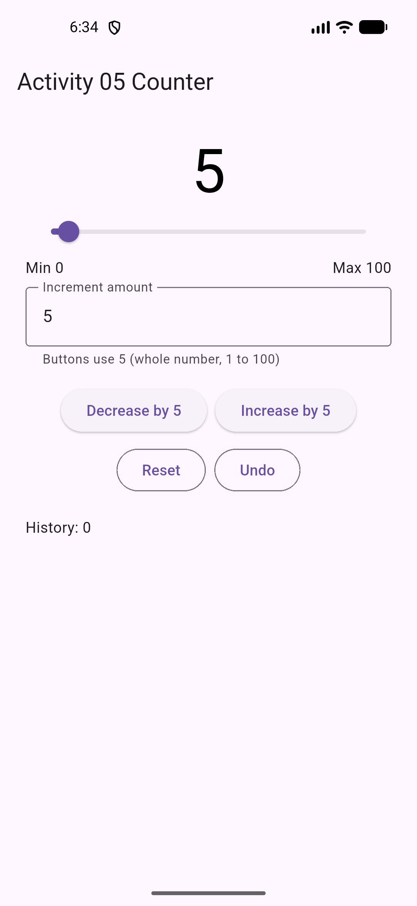
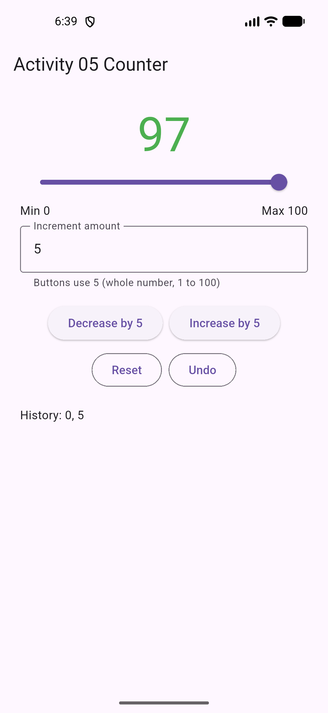
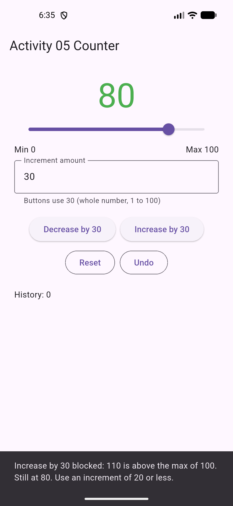
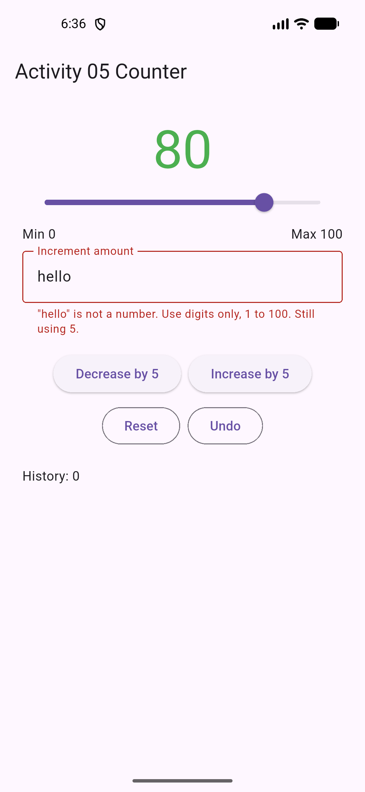

# Activity 05 Critical Thinking (Undergraduate)

**Student:** Uyiosa Nehikhuere

> Before submitting: run the sequences below in your own app, grab the screenshots marked **[Screenshot]**, and replace every **[bracketed]** part with what you actually saw. Q2 needs a real peer observation, so that part is left for you to fill.

## Question 01: History is a claim about time

On my emulator, step 4 showed "Increase by 5 blocked: 102 is above the max of 100. Still at 97. Use an increment of 3 or less." with History still 0, 5 ([shots/q1_rejected_at_97.png](shots/q1_rejected_at_97.png)), and one Undo brought the counter back to 5 with History: 0.

I traced this sequence with an increment field that starts at 1:

| Step | Action | `_counter` | `_increment` | `_history` | `_dragValue` | `_inputError` | Entry added? |
|---|---|---|---|---|---|---|---|
| 0 | App opens | 0 | 1 | [] | null | null | |
| 1 | Type `5` in field | 0 | 5 | [] | null | null | No |
| 2 | Increase by 5 | 5 | 5 | [0] | null | null | Yes |
| 3 | Drag slider to 97, release | 97 | 5 | [0, 5] | 97.0 while dragging, then null | null | Yes (once) |
| 4 | Increase by 5 (102, rejected) | 97 | 5 | [0, 5] | null | null | No |
| 5 | Undo | 5 | 5 | [0] | null | null | Removes one |

The history list is a claim that each value in it was once a real, committed counter value the user can return to. That is why only `_moveTo()` pushes to `_history`, and only after two checks pass: `_isValidValue(nextValue)` and `nextValue != _counter`. Step 1 changes `_increment`, which is a setting, not a counter state, so it gets no entry. Step 4 is rejected before `setState()`, so nothing about the past changed and nothing is recorded. Step 3 adds one entry because the slider only commits in `onChangeEnd`; `onChanged` just updates `_dragValue` for the preview. A drag is one user intention, so it is one step back.

**Incorrect but plausible policy:** push to history first, then validate. It looks harmless because the counter itself never leaves 0 to 100.  I tested it by moving `_history.add(_counter)` above the range check in `_moveTo()`. At step 4 the rejected Increase now adds 97 to history even though the counter stayed at 97. At step 5, Undo "restores" 97, so the user presses Undo and nothing visibly happens; it takes a second press to get to 5. On my emulator, after the first Undo the screen still showed 97 in green with History: 0, 5; only the second Undo showed 5 with History: 0 ([shots/q1_broken_policy_undo2.png](shots/q1_broken_policy_undo2.png)). The bad entry was never even visible, because it was added outside `setState()`, so the History line did not redraw until the Undo that removed it. The user cannot tell whether Undo is broken, which is exactly the trust problem history is supposed to prevent. The starter slider had a similar flaw: calling `_moveTo()` from `onChanged` recorded every tick, so one drag produced [N] entries and Undo walked back one number at a time.

## Question 02: Constraint feedback changes behavior

**Boundary violation:** at 80 with increment 30, I pressed Increase. The value stayed 80 and the SnackBar from `_limitMessage()` read: "Increase by 30 blocked: 110 is above the max of 100. Still at 80. Use an increment of 20 or less." At this moment the user has just tapped a button and is looking at the number, so they need three things: what they attempted (Increase by 30), which rule stopped it (max of 100, with the 110 it would have produced), and what is still possible (an increment of 20 or less). The starter only said "Counter must stay between 0 and 100," which states the rule but not the attempt or the way forward.

**Invalid input:** I typed `hello` into the increment field. `_readIncrement()` left `_increment` at 5 and set `_inputError`, so the field showed: "\"hello\" is not a number. Use digits only, 1 to 100. Still using 5." Here the user's attention is on the field, not the number, so the feedback lives inline as `errorText` instead of a SnackBar that would fire on every keystroke. The key extra fact is "Still using 5," because the user needs to know the buttons will not suddenly use a garbage value. The button labels ("Increase by 5") confirm it.

**Peer observation:** [Peer's name or initials] tried the task without help. [What they did, e.g. "typed 2.5, saw the error, then pressed Increase and was surprised it added 2 instead of 5."] [Where they hesitated.]

**Revision:** Before: "[old message]". After: "[new message]". I changed it because [reason tied to what the peer did]. [If you need an idea: keystroke validation accepts `2` before `.` arrives, so a peer typing 2.5 ends up with an increment of 2. A good revision is to make the error say "Still using 2 (from the 2 you typed)" or to validate on submit instead.]

---

# Live check cheat sheet (six blocks)

1. **Launch:** `main()` calls `runApp(const CounterApp())`; that is where Flutter starts the widget tree.
2. **App shell:** `CounterApp` is a `StatelessWidget` because the `MaterialApp` and its home never change after launch.
3. **Stateful screen:** `CounterPage` must be stateful because the counter, increment, and history change on user actions. `createState()` creates the `_CounterPageState` object that holds them and survives rebuilds.
4. **State and cleanup:** `_counter` is the committed value, `_increment` is the last valid step, `_history` is the list of prior committed values, `_incrementController` holds the field text, `_dragValue` is the slider preview, `_inputError` is the field message. `dispose()` releases the controller's listeners and resources when the screen is removed, preventing leaks.
5. **Rules and actions:** `_isValidValue` checks 0 to 100. `_counterColor` gives red at 0, green above 50, black otherwise. `_moveTo` rejects invalid or no change moves before `setState`, otherwise records history then updates. `_readIncrement` validates input and keeps the last valid increment. `_undo` pops one value or shows a message when empty. `_reset` goes through `_moveTo(0)` so it is undoable.
6. **UI:** `build()` reads state only. Buttons call `_moveTo`, `_reset`, `_undo`. Slider previews with `onChanged`, commits with `onChangeEnd`. TextField calls `_readIncrement`. Every UI change uses `setState()` inside an event handler, never inside `build()`, because calling it during build would trigger a rebuild loop.

**Valid trace:** at 5, Increase by 5 → `_moveTo(10)` → valid, differs → `setState` adds 5 to history, sets 10 → rebuild shows 10 in black.
**Rejected trace:** at 97, Increase by 5 → `_moveTo(102)` → invalid → SnackBar, return before `setState`, nothing changes.

**Changes from starter:** improved increment messages (TODO), slider history decision (TODO), boundary messages name action and next option, no history for no change moves, SnackBar replaces instead of queueing, UI improvement: inline field error with helper text, Min/Max labels, and button labels that show the active increment.
